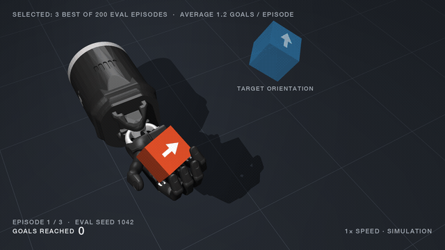

# robot

Four manipulation-learning projects, one progression. Each folder is named for
the robot it drives and the simulator it drives it in.

**Headline result.** A 500M vision-language-action model (SmolVLM2 + LoRA, 4.8M
trainable parameters) reaches **91.0%** success on LIBERO-Goal against **85.0%**
for a 27M policy trained from scratch: +6.0 pp, p = 0.0014 on 500 paired episodes
(seed 0). Remove the instruction and both collapse (0.4% and 5.2%). Full table,
method and caveats in [panda-libero](panda-libero#the-vla-on-libero-goal).

| project | robot · simulator | what it is | status |
|---|---|---|---|
| [panda-libero](panda-libero) | Franka Panda · robosuite/LIBERO | `robobench` harness; VLA vs from-scratch policy; demos from human video | results on LIBERO-Goal |
| [shadow-mujoco](shadow-mujoco) | Shadow Hand · MuJoCo | in-hand cube reorientation: PPO teacher, DAgger tactile student | trains on a laptop |
| [franka-isaac](franka-isaac) | Franka · Isaac Lab | grasp-and-lift from demonstration on a rented GPU | components 0–2 done |
| [shadow-isaac](shadow-isaac) | Shadow Hand · Isaac Lab | throw-and-catch on a palm-up hand | logic tested; not yet run on the GPU |

More about the author: [tristanengelborghs.github.io](https://tristanengelborghs.github.io).

## [panda-libero/](panda-libero) — parallel-jaw manipulation on LIBERO
A Franka Panda in robosuite/LIBERO. `robobench`: a harness for testing
visuomotor architectures with per-episode logging, first-class input ablations
and paired significance testing — plus `robobench.hand`, a vision-based
hand-tracking teleoperation pipeline that turns human video into LIBERO-format
demos. `vla` is SmolVLM2-500M with LoRA on the language model's attention and
learned action queries regressing an action chunk, compared against a 27M
ResNet-FiLM policy trained from scratch.

## [shadow-mujoco/](shadow-mujoco) — dexterous in-hand manipulation
A tendon-driven Shadow Hand in MuJoCo (an Allegro hand is also supported).
In-hand cube reorientation: custom environment, domain randomization, fingertip
tactile, threaded parallel simulation, a PPO teacher on privileged state and a
DAgger student on proprio + tactile.

*The PPO teacher after ~120k environment steps (the laptop smoke run),
deterministic, real time. These are the best 3 of 200 evaluation episodes (9, 7
and 6 goals); the average is 1.2 goals per 5-second episode, against 0.34 for
random actions. [Unselected episodes](https://tristanengelborghs.github.io/assets/media/shadow-reorient-unselected.mp4).*

## [franka-isaac/](franka-isaac) — learning from demonstration in Isaac Lab
A Franka arm in Isaac Lab. Block grasping and lifting driven by human
demonstration: teleoperation, differential IK, recorded demos validated by
replay, and imitation, with residual RL for the approach and grasp. The plan is
in [note.md](note.md).

## [shadow-isaac/](shadow-isaac) — throw-and-catch in Isaac Lab
The same Shadow Hand in Isaac Lab, palm up: a ball is dropped into it, then
tossed into it, then popped up by the fingers and caught again. A random policy
essentially never catches anything, which is what thousands of parallel
environments are for. Phases, reward and termination live in tested NumPy, with
the batched torch version held to it by a parity test.

The split is the interesting part: `panda-libero` treats the hand as one scalar
and learns *where to move an arm*; `shadow-mujoco` fixes the arm and learns *how
to exploit contact*. The second problem is the one that does not reduce to the
first. `franka-isaac` sits on the first side by design — the whole
demonstration-to-policy pipeline, honestly measured, on the simplest task — and
`shadow-isaac` takes the hand to the scale the second side needs.

Note that `panda-libero` and `franka-isaac` drive the *same* arm, a Franka
Emika Panda; robosuite calls it Panda and Isaac calls it Franka. What separates
them is the simulator and the task, which is why both halves of the name matter.

Each project is self-contained: own venv, own Makefile, own tests
(`make test` in any of them — no downloads, no GPU, no simulator assets
needed). Running them is where they differ: `panda-libero` and `shadow-mujoco`
run on a laptop (the VLA trains on a rented GPU), while `franka-isaac` and
`shadow-isaac` need an NVIDIA GPU and drive a rented cloud box.

The Python packages keep their own names — `robobench`, `dexhand`, `insertion`,
`catching` — since package names cannot contain hyphens and imports should not
churn with directory names.

Parts of `franka-isaac/` come from NVIDIA Isaac Lab (BSD-3-Clause); see
[THIRD_PARTY_NOTICES.md](THIRD_PARTY_NOTICES.md).
